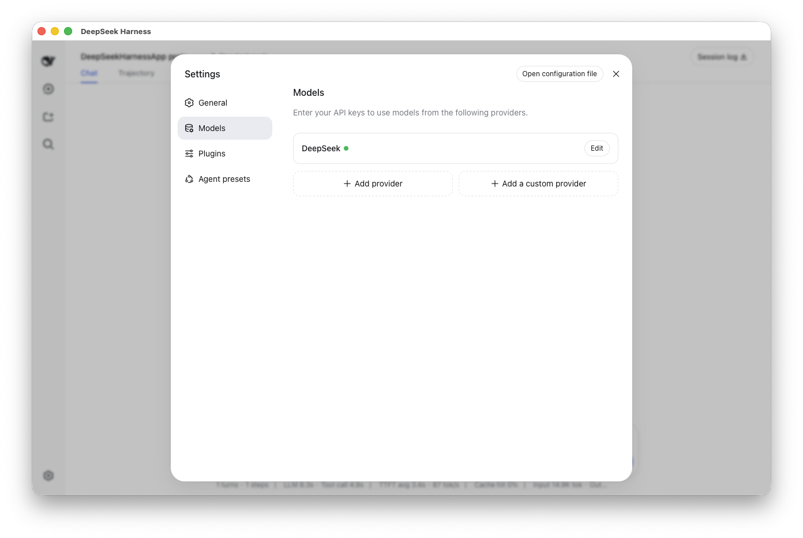

# DeepSeek Harness for macOS

Current release: **0.2.1** · [Changelog](CHANGELOG.md)

A lightweight native macOS wrapper for the official [DeepSeek Harness](https://github.com/deepseek-ai/deepseek-harness) Web UI.

It turns the local Harness server into a normal Mac app: double-click to launch, use it in a dedicated window, and let the app start or reconnect to `dsh` automatically.

> Community project. This repository is not affiliated with, endorsed by, or maintained by DeepSeek.

[中文说明](README.zh-CN.md)

## Screenshot



## Features

- Native SwiftUI window with an embedded Harness Web UI
- Connects to an existing Harness server at `127.0.0.1:3080`
- Starts the locally installed `dsh` server when one is not already running
- Stops only the server process started by the app itself
- Keeps Harness workspaces, sessions, model providers, and credentials in their original storage
- Keeps ordinary main-view external links in the default browser
- Supports a true embedded right-sidebar browser with address navigation, back, forward, and reload
- Includes a right-sidebar terminal rooted in the active workspace
- Remembers the right-sidebar width across launches
- Plays local MP3 audio and MP4 video from a left-sidebar media player
- Supports the model providers available in the installed Harness version, including custom providers

## Requirements

- macOS 14 or later
- Apple Silicon Mac
- Xcode Command Line Tools or Xcode with Swift 5.10 or later
- Node.js 22.19 or later
- DeepSeek Harness installed globally:

```bash
npm install -g @deepseek-ai/dsh
```

## Build and run

```bash
git clone https://github.com/Starmadebydata/deepseek-harness-macos.git
cd deepseek-harness-macos
./script/build_and_run.sh
```

The normal run command also installs the bundled right-sidebar plugin into the local Harness `web` profile. If that profile does not exist yet, run `dsh web` once, stop it, and rerun the command above.

The app bundle is generated at:

```text
dist/DeepSeek Harness.app
```

Build without launching:

```bash
./script/build_and_run.sh --build
```

Install or refresh only the sidebar plugin:

```bash
./script/build_and_run.sh --install-plugin
```

Run tests:

```bash
swift test
```

## Model providers

Provider configuration remains inside DeepSeek Harness. Open **Settings → Models** to configure an official provider or add a custom endpoint. API keys are handled by Harness and are not written into this repository.

## Right sidebar

The bundled `dsh-right-sidebar` plugin adds session search, recent files, session overview, an embedded browser, and a workspace terminal. The installer updates only the local `web` profile dependency and patch entries required by this plugin. It does not read or copy API keys.

Terminal commands run locally with the same user permissions as the app and are executed only after the user enters them.

## How it works

On launch, the app checks `http://127.0.0.1:3080`:

1. If Harness is already running, the app connects without taking ownership of that process.
2. Otherwise, it finds the installed `dsh` executable and starts `dsh web` locally.
3. On quit, it terminates the server only when that server was started by the app.

Release history is available in [CHANGELOG.md](CHANGELOG.md).

## Distribution note

Local builds use ad-hoc signing. They are intended for development and personal use. Public binary releases require an Apple Developer ID certificate and notarization.

## Contributing

See [CONTRIBUTING.md](CONTRIBUTING.md).

## Security

See [SECURITY.md](SECURITY.md) for reporting security issues.

## License

This wrapper is released under the [MIT License](LICENSE). DeepSeek Harness is a separate project with its own license and trademarks.
